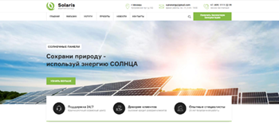
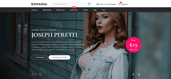

# Tutotials

## menu 

[Queen-menu](https://KostasNegrov.github.io/queen-menu "Описание"): интересное анимированное меню с выезжающим контентом слева и справа. 
    
---
## forms

[blue_rocket_form](https://KostasNegrov.github.io/blue_rocket_form "Описание"): синяя форма с переваливающимися шарами туда-сюда:) 
    
---
## GSAP

[real_estate_theme](https://KostasNegrov.github.io/real_estate_theme "Описание"): анимации при scrollTrigger на GSAP. Исчезающие заголовки и паралакс изображений. 
    
---

## parallax effects

[parallax_JS_plugin](https://KostasNegrov.github.io/parallax_JS_plugin "Описание"): летающий ангел в облаках с паралакс эфектом. 
    
---

### Один из первых моих проектов

[Посмотреть](https://kostasnegrov.github.io/exe/build "Описание")

---

### Сайт портфолио full-stack разработчика Негрова Андрея

    
* реализовал дизайн(отрисовка в фотошопе);
* применил технологию FlexBox верстки;
* фиксированный hedear, сжимающийся при скролле;
* форма обратной связи на jQuerry;
* подключил библиотеку Slider-Pro, освоил её функционал;
* секция "мои навыки" написал скрипт для tabs;
* подключил Яндекс карту.  

[Посмотреть](https://kostasnegrov.github.io/resumeNA/ "Описание")

---

### Корпоративный сайт компании по установке солнечных батарей Solaris

* отрисовка макета в фотошоп;
* верстка с помощью Flexbox:
* подключение Owl Carousel и Slider-pro;
* работа с SVG графикой;
* video на сайте;   

[Посмотреть](https://kostasnegrov.github.io/solaris/build "Описание")

---

### Интернет магазин молодежной одежды Dovaina

                     

[Посмотреть](https://kostasnegrov.github.io/dovaina/build "Описание")

---

